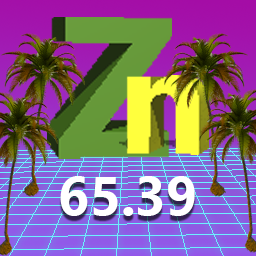

# ZINC

**ZINC** (ZINC Is Not Codingbat) is a software bundle that is designed to customize and create Java coding questions that can be accessed through a browser and interactively checked.

## For whom this is designed
Basically people who want to create their own 
"Codingbat practices".

## Features
- Online Java question answering
- GUI-based question creating
- Auto checking answer
- Running Java in browser
- Saving user response to local

## How to use
The software is divided into 2 parts. The first part is the **Creator**, which is a software with PyQt5 based GUI to allow users to create their question files. To run it, type in your console:
`python /path/to/gui.py`

After creating the question file, the question files need to be loaded into the server and configure the path in **Webapp**, which is a Flask based software, to allow it to be hosted online. Place your question files into the root directory of your questions folder. Go ahead and modify the `path` variable in the `webapp.py` to point to your path to question folder, and change the `apiID` variable and `apiSecret` variable in `runner.py` to your id and secret of JDoodle API.

When you are done with everything, run in your counsole:`python /path/to/webapp.py` For production environment please use WSGI software, like `gunicorn`, and web server instead of running directly.

Finally, the end users will be accessing it through their browser.

## How to install it
### Software requirements:
- Python 3
- Flask
- Flask-WTF
- Flask-Login
- PyQt5
- Requests
### Installation process
Clone the whole resporitry to your computer and the server. 
 
## Contributers
- umousesonic

## Credits
- Flask
- Flask-WTF
- Flask-Login
- PyQt5
- Python
- Requests